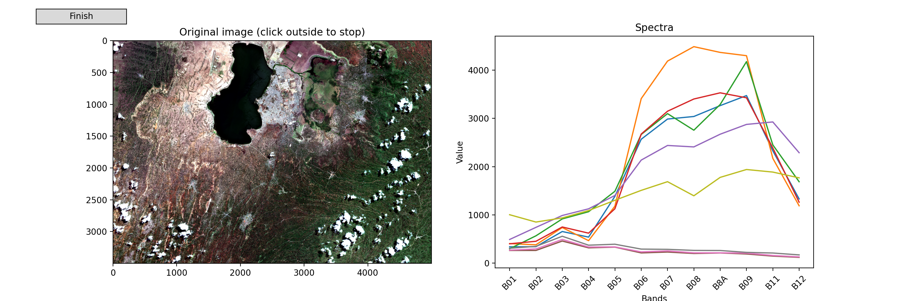

Rastereasy
==========

Click on the logo to access the complete documentation with many examples and notebooks.

[](https://rastereasy.github.io/)


Introduction
============

**rastereasy** is a Python library for simple manipulation of geospatial raster and vector data (e.g., *.tif, *.jp2, *.shp). The goal is to simplify geospatial workflows by offering tools for reading and processing raster and vector files, resampling, cropping, reprojecting, stacking, filtering, etc of raster images, easy visualizations such as color composites and spectral plots, use (train / apply) some classical Machine Learning algorithms on images, provide some tools for late fusion of classifications (Dempster-Shafer), ...

The main class, `Geoimage`, enables to process raster similarly than numpy arrays while keeping and adapting all meta data.

**Documentation**

A complete documentation can be found [here](https://rastereasy.github.io/)


**Example Usage**

Here's a quick example of what you can do with rastereasy:

```python
 import rastereasy

 # Load a georeferenced image
 image = rastereasy.Geoimage("example.tif")

 # Get image information
 image.info()

 # Print value of pixel [100,200]
 print(image[100,200])

 # Create a color composite
 image.colorcomp(['4', '3', '2'])

 # Resample and reproject
 image_resampled = image.resample(2)
 image_reproject = image.reproject("EPSG:4326")

 # Save the processed image
 image.save("processed_image.tif")


```
# Installation

####  With pip

Install **rastereasy** via `pip` (the easiest method):

```shell
 $ pip install rastereasy
```

#### From source

To install rastereasy from source:

1. Clone the repository from GitHub:
```shell
$ git clone https://github.com/pythonraster/rastereasy.git
```
2. Navigate to the repository's root directory:
```shell
$ cd rastereasy
```
3. Install the package using pip:
```shell
$ pip install .
```

# Interactive Visualization Notes
 

## Jupyter notebooks

As illustrated, **rastereasy** supports interactive plotting of spectral bands for individual pixels. To enable this functionality in Jupyter Notebook, rastereasy installs some Jupyter extensions in your environment. If it doesn't work, you may need to rebuild jupyter by the command:

```
jupyter lab build
```

## Google Colab

To use the interactive plotting features in Google Colab, a special two-step setup is required.Follow these steps in the exact order. Separating the commands into different cells and restarting the session is **essential**.

### Step 1: Install Libraries

Run the following cell to install rastereasy and the necessary dependencies for interactive widgets.

```
!pip install rastereasy ipympl
from google.colab import output
output.enable_custom_widget_manager()
```

### Step 2: Restart the Runtime

After the installation is complete, you must restart the runtime.

Go to the menu: `Runtime > Restart` runtime (or use the shortcut Ctrl+M).

### Step 3: Run Your Code

After restarting, you can now enable the interactive mode and use the library in a new cell.

```
%matplotlib widget
import rastereasy
```


 <!--
1. Install the required Jupyter extensions: --
 ```
pip install ipympl
```

2. Rebuild JupyterLab:
```
jupyter lab build
``` -->
------

# To do

Check conda installation

Authors
=======
- [Thomas Corpetti](https://tcorpetti.github.io/)
- Pierrick Matelot
- Augustin de la Brosse
- [Candide Lissak](https://clissak.github.io/)

Citation
=======
If you use rastereasy, please cite:

Thomas Corpetti, Pierrick Matelot, Augustin de la Brosse, Candide Lissak
Rastereasy: A Python package for an easy manipulation of remote sensing images
Journal of Open Source Software, submitted, 2025.


## License
This project is licensed under the MIT License – see the [LICENCE](https://github.com/pythonraster/rastereasy/blob/main/LICENCE) file for details.

## Releases

0.3.2
-----


**Improvements**:

- `im2tiles`: Output Folder Management (Breaking Change)

The default behavior of the `im2tiles` function has been changed. If the output folder already exists, the function will now delete by default any existing snippets within it before generating new ones.

To keep the existing snippets during execution, use the new argument: `reset=False`.

- `astype`: New In-Place Modification Option (`inplace`)

A new inplace parameter has been added to the astype function.

If `inplace=True`, the data type modification will be performed directly on the current object. By default, `inplace=False`, which returns a new instance with the modified data type.


0.3.1
-----


**Bug fixes & improvement**:

  - Naming: Fixed an issue where band names could be reset when manipulating images that already had saved names.

  - im2tiles: Now clears any existing snippets in a folder before saving new ones, preventing leftover files from previous runs.

0.3.0
-----

This new version introduces several new features and improvements focused on dimensionality reduction, visualization, and overall consistency across the library.

**New features**

- Dimensionality reduction: Added support for PCA, t-SNE, and LLE methods for feature extraction and visualization.

- Visualization: Added a `zoom` parameter to all visualization functions (.visu(), .colorcomp(), .plot_spectra()), allowing users to focus on specific regions of interest.

**Improvements**

- Crop function harmonization: The `crop()` function has been standardized.
It now accepts either:

  - a pixel-based area definition: `area=((deb_row, end_row), (deb_col, end_col))`, or

  - geographic coordinates of the north-west (lat1, lon1) and south-east (lat2, lon2) corners.

- Consistent documentation: Updated comments and docstrings to ensure consistency with the `predict()` function and other ML-related methods.

**Bug fixes**

- Fixed a bug occurring when opening windowed versions of images that caused incorrect band naming.


0.2.2
-----
- Minor bug in plotting

0.2.1
-----
- Added a new boolean test: `image.isnan()` to check for NaN values in an image.

- Renamed `resampling()` to `resample()`.

  - Both functions remain available in this version, but `resampling()` is deprecated and will be removed in a future release.

- Renamed `apply_ML_model()` to `predict()`.

  - Both functions remain available in this version, but `apply_ML_model()` is deprecated and will be removed in a future release.


0.2.0
-----
This release introduces several new features (custom band names persistence, metadata-only loading, partial image reading, improved lat/lon visualization, and warnings for multi-band stacks) while remaining fully backward compatible.
The version has therefore been bumped from 0.1.4 to 0.2.0.

Here are the main changes

- User-defined band names

  - Band names set by the user via im.change_names are now automatically saved with im.save and reloaded with rastereasy.Geoimage.

- Metadata-only loading

  - You can now load only the metadata without reading the full image using `meta_only=True`: `im = rastereasy.Geoimage('myimage.tif', meta_only=True)`

- Partial image reading (window or area)

  - It is now possible to read a specific part of the image with the area parameter:

  - By indices: `area=((start_row, end_row), (start_col, end_col))`

  - By geographic coordinates: `area=((lon1, lon2), (lat1, lat2))` with `extent='latlon'`


- Warning for multi-band images in files2stack

  - When using rastereasy.files2stack with images containing multiple bands, a warning is displayed to inform the user.

- Minor bugs in visualization for latitude/longitude coordinates has also been fixed.


0.1.4
-----

September 2025.
Add useful functions for ML

0.1.3
-----

September 2025.
Minor corrections in help of functions

0.1.2
-----

September 2025.
Add filters (gaussian, median, laplace, sobel and generic) functions.

0.1.1
-----

June 2025.
Minor bugs related to interactive visualization fixed (works in console and notebooks).


0.1.0
-----

June 2025.
First release, version 0.1.0
