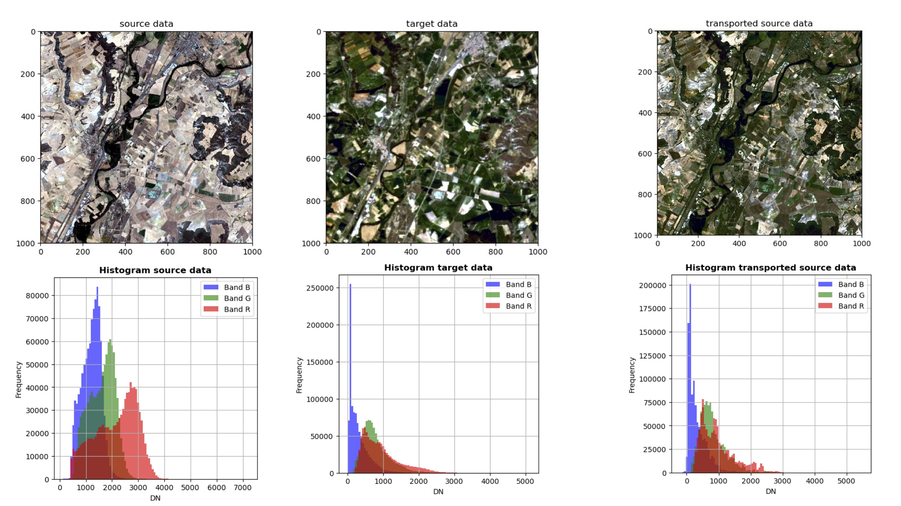
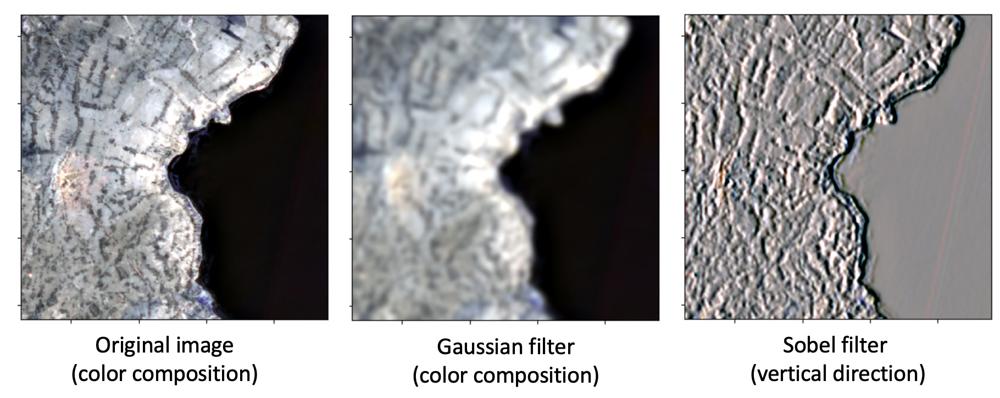

# Summary

Working with remote sensing data often involves managing large, multi-band georeferenced rasters with varying spatial resolutions, extents, and coordinate reference systems [@mamatov2024geospatial].

`rastereasy` is a Python library designed to provide a high-level, human-readable interface for common geospatial raster and vector operations (e.g., *.tif, *.jp2, *.shp) [@ritter1997geotiff; @mamatov2024geospatial]. Built on well-established libraries including `rasterio`, `numpy`, `shapely`, `geopandas`, and `scikit-learn` [@gillies2013rasterio; @harris2020array; @gillies2013shapely; @jordahl2021geopandas; @kramer2016scikit], it enables users to perform typical GIS tasks—such as resampling, cropping, reprojection, stacking, clipping rasters with shapefiles, or rasterizing vector layers—in just a few lines of code. Some basic machine learning functionalities (clustering, fusion) are also implemented.

By abstracting away much of the underlying technical complexity, `rastereasy` makes geospatial processing directly accessible within Python scripts. It is particularly suited for analysts and machine learning practitioners who need to integrate geospatial data handling into their workflows without deep GIS expertise, while also helping experienced geographers prototype more quickly. Beyond core raster operations, it includes utilities for harmonizing multi-source imagery, performing clustering and domain adaptation, and preparing datasets for downstream analysis.

With its current implementation, `rastereasy` provides a solid foundation for further development and integration into the Python geospatial ecosystem.

# Statement of need

Many established remote sensing libraries such as `rasterio`, `Raster Forge`, `PODPAC`, `EarthPy` or `GDAL` [@garrard2016geoprocessing; @gillies2013rasterio; @oliveira2024raster; @ueckermann2020podpac; @Wasser2019EarthPy] provide extensive and powerful functionality for reading, writing, and processing geospatial raster data. However, they can be verbose and often require a solid understanding of geospatial concepts such as projections, data structures, coordinate reference systems, geotransforms, and metadata management. While efficient, many of these libraries are specialized in specific sub-tasks (e.g., visualization, array manipulation, or graphical interfaces) and may not fully meet the needs of users whose primary expertise lies outside GIS, such as data scientists, ecologists, agronomists, or climate researchers. As a result, the learning curve can be steep and may slow down the development of operational workflows.

`rastereasy` addresses this gap by offering a high-level, human-readable interface that abstracts away much of the underlying complexity while retaining the flexibility of the core libraries. Rather than replacing efficient lower-level libraries, `rastereasy` builds upon them, most notably `rasterio`, `shapely`, `geopandas`, and abstracts away repetitive or technical boilerplate code. This design makes it possible to perform in a few lines of Python what would otherwise require many more lines in a raw `rasterio` or `GDAL` workflow. It provides streamlined access to common geospatial operations, including:

-   **Band manipulation**:  select, reorder, or remove spectral bands by index or by name.

-   **Tiling and stitching**:  split large rasters into smaller tiles for processing or machine learning workflows, and reconstruct them when needed.

-   **Harmonization**: align rasters with different resolutions, projections, and extents, optionally adapting spectral values via domain adaptation [@courty2016optimal].

-   **Visualization tools**: quickly generate color composites, histograms, and spectral plots for georeferenced images.

-   **Filtering**: apply common filters (Gaussian, Laplacian, Sobel, median) or custom convolution kernels..

-   **Basics of machine learning**: clustering [@ikotun2023k] and classification fusion using the Dempster–Shafer framework [@shafer1992dempster].

`rastereasy` is intended for researchers and practitioners who need to integrate geospatial raster processing into broader data analysis or machine learning pipelines, without having to become GIS specialists. At the same time, it can also benefit geographers and remote sensing experts by offering a concise syntax for prototyping and testing ideas quickly.

# Example of use

The core class of `rastereasy` is **GeoImage**, which wraps a raster as a `numpy` array while preserving all georeferencing metadata. The  **GeoImage**  class provides numerous functions to manipulate images (crop, reproject, resample, stack, extract bands, etc.), process them (e.g., filtering), visualize them, harmonize bands, manage band names, or even perform fusion and basic machine learning algorithms.

All these operations are carried out while preserving spatial consistency. Users can therefore manipulate spectral bands with high-level functions, compute features such as vegetation or water indices [@xue2017significant] (NDVI, NDWI), extract specific areas of interest, or filter images efficiently.

Apart from  **GeoImage** class,  `rastereasy` also provides functions to handle bounding boxes (e.g., extracting common areas between two images, or extending the spatial area of an image to match the extent of another) and to create stacks from individual band files.

## Visualization

Here are some outputs to visualize histograms, spectra, and color composites.

](./illustrations2.jpg "example of images")

## Harmonization of bands

Here is an example of adapting the histogram of a source image to a target image (domain adaptation), which is useful, for instance, when applying a machine learning algorithm trained on the target domain to the source domain.

## Filters

Most classical filters (Gaussian, Laplacian, Sobel, and median) as well as user-defined generic filters can be performed, as illustrated below.

For additional functionalities such as spectral plots, rasterization, harmonization, clustering, or classification fusion, see the [rastereasy documentation](https://rastereasy.github.io/).

# Performance and Scalability

`rastereasy` is designed as a high-level wrapper around efficient geospatial libraries such as `rasterio`, `numpy`, and `geopandas`. In its current implementation, the default behavior is either to load full rasters into memory, or it also supports windowed reading via the underlying `rasterio`  API, allowing users to read and process only subsets of rasters without loading entire files into memory.

While this is convenient for small to medium-sized datasets, it can become a limiting factor when working with very large georeferenced images (e.g., > 10 GB).

Currently, most operations are single-threaded and executed in memory; planned enhancements include lazy loading (processing data on demand) and parallel processing (e.g., for tiling, reprojection, or large mosaics) to improve scalability.

# Acknowledgments

This library is partly supported by the [ANR MONI-TREE](https://moni-tree.github.io/) project (ANR-23-CE04-0017)

# References
